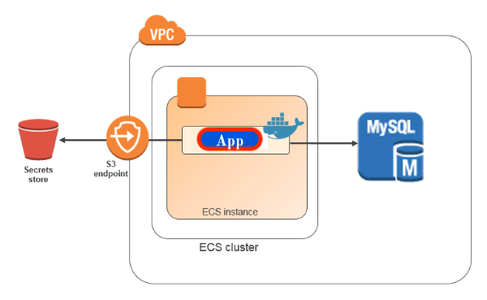
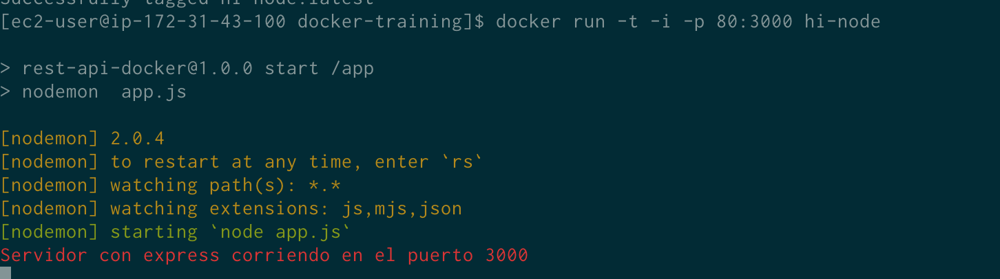

# Docker Training


---

##  Tabla de contenidos


- [Introduccíon](#Introducción)
- [About](#About )
- [Arquitectura](#Arquitectura)
- [Instalación](#instalación)
- [Características](#Características)
- [Team](#team)
- [Anexo](#Anexo)


---

 
## Introducción

-  🇬🇧 ENG - The main goal of this project is to practice Docker. 
              
  - 🇪🇸 ESP - Desarrollo de una sencilla aplicacion en Node para ser desplegada en un contenedor de docker. El objetivo es la configuración completa en una instancia EC2 de AWS.
 
---
 ## About

  -  Prácticando docker by [Jhosef A. Cardich Palma](https://www.linkedin.com/in/jhosef-anderson-cardich-palma-74765788/). 
     
 
 ---
## Arquitectura


 ***Organización del proyecto***
- Despligue de un contenedor dentro de EC2 AMI : 

 


## Instalación

 #### Iniciando el servidor sin docker 

Express corre en el puerto 3000.
el comando que se ejecuta para para arrancar el servidor es (tambien es lo que ejecuta docker en el Dockerfile para iniciar la app):
```
$ npm run start 
```
---

 #### Configuración de Docker en local
-  Se han usado los siguientes comandos para crear la imagen Docker de la aplicación

> 1 - Build the Image
````
$ docker build -t hi-node .
````

> 2 - Run container 

In order to the containter (with the Node express server inside) we have to map the internal (docker runs node in port 3000) port in wich our application is running  with a external port (host port 9000) in wich the app will be accesible.

````
$ docker run -p 9000:3000 hi-node .
````
We should obtain this message in the terminal: 
````
> rest-api-docker@1.0.0 start /app
> node app.js

Servidor con express corriendo en el puerto 3000
````

### Dev mode (Optional)
If we are developing or changing the app maybe we'd need to see the changes reflected on the container, so we have to configure, trough  the 
creation of a Volume plus the use of nodemon as 
a dev dependency (see package.js), to reflect the changes we made.
> 1 - Add nodemoon as a dev dependency
It's recomended to run the aplication before intall nodemoon
```
$ npm install --save-dev nodemon
```
> 2 - rebuild the image

We made changes in the package.json so we have to rebuild 
```
$ docker build -t hi-node .
```
> 3 - Binding source code to the volumes

The "-it" option stands for "interactive mode", useful to see the changes live
```
$ docker run -it -p 9000:3000 -v $(pwd):/app hi-node
```
If everything goes well we`ll see the net message in the terminal:
```
> rest-api-docker@1.0.0 start /app
> nodemon  app.js

[nodemon] 2.0.4
[nodemon] to restart at any time, enter `rs`
[nodemon] watching path(s): *.*
[nodemon] watching extensions: js,mjs,json
[nodemon] starting `node app.js`
Servidor con express corriendo en el puerto 3000

```
---
### AWS Configuration

#### Dependencies

- First of all an AWS account is nedeed.
- [Docker Basic installation on EC2 AMI ](https://docs.aws.amazon.com/AmazonECS/latest/developerguide/docker-basics.html)

- [AWS Segurity Groups Tutorial on YouTube. ](https://www.youtube.com/watch?v=1fnPCWBikYQ). It's necesary for configure all the Segurity Groups.


#### Deployment in EC2 AMI Instance

> 1 -  Build

```
$ docker build -t  hi-node .
```

> 2 - Run

```
$ docker run -t -i -p 80:3000 hi-node
```

> 3 - Running 

 
---

> 4 - Checkout it's working 

Go to:  ec2-15-188-54-185.eu-west-3.compute.amazonaws.com

You should be able to see this message in the browser: 


## Características

Se irán definiendo dentro durante el proyecto


#### App en el contenedor
- Aplicacíon en Node con Express que muestra el siguiente mensaje:

````
Hello World, this is My Express API in a Docker Container. BTW, Said is HOT !

````


## Dependencias

Los siguientes paquetes de software son necesarios en el sistema para poder hacer funcional la aplicación:
- Local:
  - [Docker](https://www.docker.com/)

- On AWS:
  - [Git for EC2 AMI Installation](https://cloudaffaire.com/how-to-install-git-in-aws-ec2-instance/)


## Team
> Contributors/People

| <a href="https://www.linkedin.com/in/jhosef-anderson-cardich-palma-74765788/" target="_blank">**Jhosef A. Cardich Palma**</a> | 
| :---: |
|  <a href="https://www.linkedin.com/in/jhosef-anderson-cardich-palma-74765788/" target="_blank"></a>   |
|***Full-Stack Software Developer***|
| Linkedin:   <a href="https://www.linkedin.com/in/jhosef-anderson-cardich-palma-74765788/" target="_blank">` Jhosef A. Cardich Palma`</a>| 
| Twitter: <a href="http://twitter.com/jhosefcardich" target="_blank">`@JhosefCardich`</a>| 
|Instagram: <a href="http://instagram.com/arts_hot" target="_blank">`@ARTS-HOT`</a>

---
## Anexo

Cosas útiles: 

> 1 - Comandos de Admin de containters de Docker 


 - [Comandos](https://blog.baudson.de/blog/stop-and-remove-all-docker-containers-and-images)


