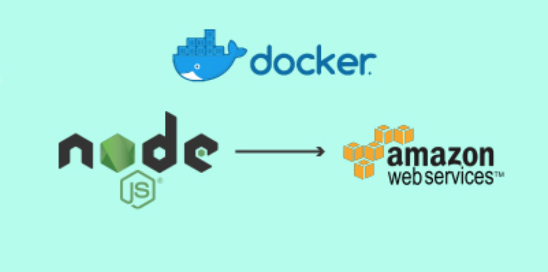

# Docker Training


---

##  Tabla de contenidos


- [Introduccíon](#Introducción)
- [About](#About )
- [Arquitectura](#Arquitectura)
- [Instalación](#instalación)
- [Características](#Características)
- [Team](#team)
- [Anexo](#Anexo)


---

 
## Introducción

-  🇬🇧 ENG - The main goal of this project is to work ..
              
  - 🇪🇸 ESP - Desarrollo de una sencilla aplicacion para ser desplegada en un contenedor de docker. El objetivo es la configuración completa en una instancia EC2 de AWS.
 
---
 ## About

  -  Prácticando docker by [Jhosef A. Cardich Palma](https://www.linkedin.com/in/jhosef-anderson-cardich-palma-74765788/). 
     
 
 ---
## Arquitectura


 ***Organización del proyecto***
- Se cuenta con una aplicación Java,una base de datos SQLite3, y algún cliente a desarrollarse. 
> Esta es una primera version de lo que podría ser 
 


## Instalación


 #### Configuración Entorno
-  Se usa el entorno de desarrollo ....


---
 

## Características

Se irán definiendo dentro durante el proyecto


#### App en el contenedor
- Aplicacíon sencilla a implementar.

````
- Funcionalidad 1

````


## Dependencias

Los siguientes paquetes de software son necesarios en el sistema para poder hacer funcional la aplicación:
- [Docker](https://www.docker.com/)


## Team
> Contributors/People

| <a href="https://www.linkedin.com/in/jhosef-anderson-cardich-palma-74765788/" target="_blank">**Jhosef A. Cardich Palma**</a> | 
| :---: |
|  <a href="https://www.linkedin.com/in/jhosef-anderson-cardich-palma-74765788/" target="_blank"></a>   |
|***Full-Stack Software Developer***|
| Linkedin:   <a href="https://www.linkedin.com/in/jhosef-anderson-cardich-palma-74765788/" target="_blank">` Jhosef A. Cardich Palma`</a>| 
| Twitter: <a href="http://twitter.com/jhosefcardich" target="_blank">`@JhosefCardich`</a>| 
|Instagram: <a href="http://instagram.com/arts_hot" target="_blank">`@ARTS-HOT`</a>

---
## Anexo

Cuando se quiera implementar un proyecto en Django por primera vez seguir los siguientes pasos:


> 1 - Step 1 
```
$ script..
 ```
 - Entonces podremos observar el siguiente mensaje: 

```
Nice message
```
