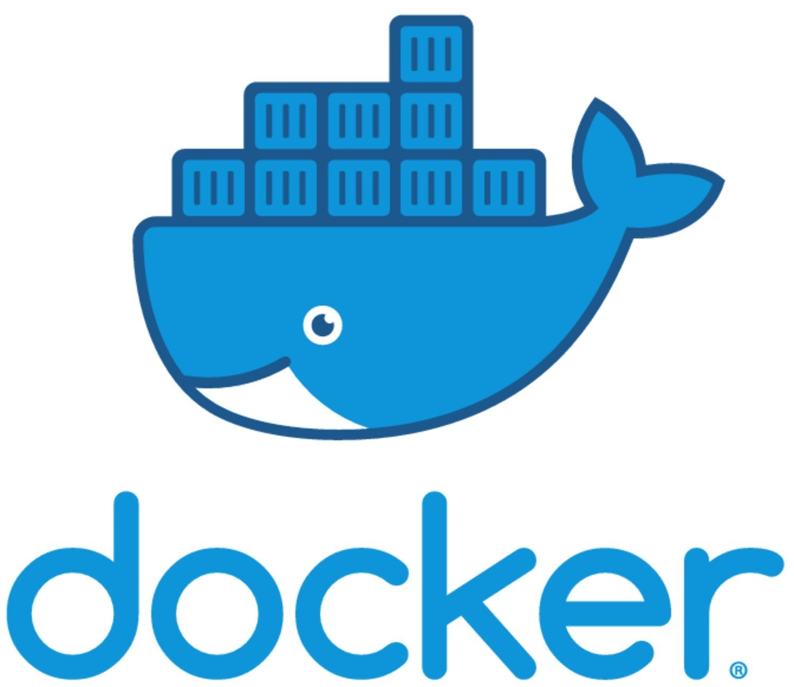

# Docker Training


---

##  Tabla de contenidos


- [Introduccíon](#Introducción)
- [About](#About )
- [Arquitectura](#Arquitectura)
- [Instalación](#instalación)
- [Características](#Características)
- [Team](#team)
- [Anexo](#Anexo)


---

 
## Introducción

-  🇬🇧 ENG - The main goal of this project is to practice Docker. 
              
  - 🇪🇸 ESP - Desarrollo de una sencilla aplicacion en Node para ser desplegada en un contenedor de docker. El objetivo es la configuración completa en una instancia EC2 de AWS.
 
---
 ## About

  -  Prácticando docker by [Jhosef A. Cardich Palma](https://www.linkedin.com/in/jhosef-anderson-cardich-palma-74765788/). 
     
 
 ---
## Arquitectura


 ***Organización del proyecto***
- Se cuenta con una aplicación Java,una base de datos SQLite3, y algún cliente a desarrollarse. 
> Esta es una primera version de lo que podría ser 
 


## Instalación

 #### Iniciando el servidor

Express corre en el puerto 3000.
el comando que se ejecuta para para arrancar el servidor es (tambien es lo que ejecuta docker en el Dockerfile para iniciar la app):
```
$ npm run start 
```

 #### Configuración de Docker
-  Se han usado los siguientes comandos para crear la imagen Docker de la aplicación

> 1 - Build the Image
````
$ docker build -t hi-node .
````

> 2 - Run container 

In order to the containter (with the Node express server inside) we have to map the internal (docker runs node in port 3000) port in wich our application is running  with a external port (host port 9000) in wich the app will be accesible.
````
$ docker run -p 9000:3000 hi-node .
````
We should obtain this message in the terminal: 
````
> rest-api-docker@1.0.0 start /app
> node app.js

Servidor con express corriendo en el puerto 3000
````

## Dev mode
If we are developing or changing the app maybe we'd need to see the changes reflected on the container, so we have to configure, trough  the 
creation of a Volume plus the use of nodemon as 
a dev dependency (see package.js), to reflect the changes we made.
> 1 - Add nodemoon as a dev dependency
It's recomended to run the aplication before intall nodemoon
```
$ npm install --save-dev nodemon
```
> 2 - rebuild the image

We made changes in the package.json so we have to rebuild 
```

```
> 3 - Binding source code to the volumes

The "-it" option stands for "interactive mode", useful to see the changes live
```
$ docker run -it -p 9000:3000 -v $(pwd):/app hi-node
```
If everything goes well we`ll see the net message in the terminal:
```
> rest-api-docker@1.0.0 start /app
> nodemon  app.js

[nodemon] 2.0.4
[nodemon] to restart at any time, enter `rs`
[nodemon] watching path(s): *.*
[nodemon] watching extensions: js,mjs,json
[nodemon] starting `node app.js`
Servidor con express corriendo en el puerto 3000

```
---
 

## Características

Se irán definiendo dentro durante el proyecto


#### App en el contenedor
- Aplicacíon sencilla a implementar.

````
- Funcionalidad 1

````


## Dependencias

Los siguientes paquetes de software son necesarios en el sistema para poder hacer funcional la aplicación:
- [Docker](https://www.docker.com/)


## Team
> Contributors/People

| <a href="https://www.linkedin.com/in/jhosef-anderson-cardich-palma-74765788/" target="_blank">**Jhosef A. Cardich Palma**</a> | 
| :---: |
|  <a href="https://www.linkedin.com/in/jhosef-anderson-cardich-palma-74765788/" target="_blank"></a>   |
|***Full-Stack Software Developer***|
| Linkedin:   <a href="https://www.linkedin.com/in/jhosef-anderson-cardich-palma-74765788/" target="_blank">` Jhosef A. Cardich Palma`</a>| 
| Twitter: <a href="http://twitter.com/jhosefcardich" target="_blank">`@JhosefCardich`</a>| 
|Instagram: <a href="http://instagram.com/arts_hot" target="_blank">`@ARTS-HOT`</a>

---
## Anexo

Cuando se quiera implementar un proyecto en Django por primera vez seguir los siguientes pasos:


> 1 - Step 1 
```
$ script..
 ```
 - Entonces podremos observar el siguiente mensaje: 

```
Nice message
```
